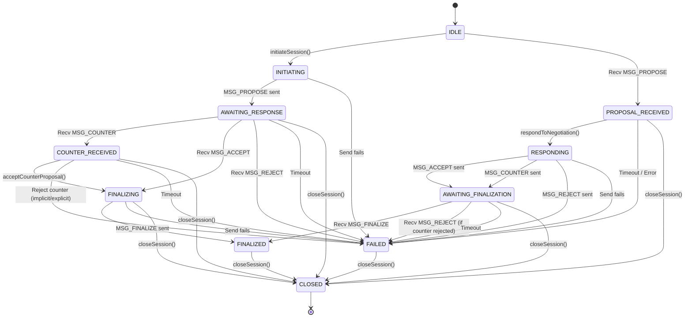

# Xenocomm Negotiation Protocol: State Machine & Message Flow

This document details the state machine and message sequence for the `NegotiationProtocol` module within the Xenocomm SDK.

## 1. Goal

To allow two agents (an *Initiator* and a *Responder*) to dynamically agree upon a set of `NegotiableParams` for a communication session before data transmission begins. This supports adaptability and optimization.

## 2. States (`NegotiationState` Enum)

The negotiation process progresses through the following states. Some states are specific to the Initiator or Responder role, while others are shared.

*   **Shared States:**
    *   `IDLE`: No active session (Initial state, or after `CLOSED`/`FAILED`).
    *   `FINALIZED`: Negotiation successful, parameters agreed upon. Terminal success state.
    *   `FAILED`: Negotiation failed (rejection, timeout, error). Terminal failure state.
    *   `CLOSED`: Session explicitly closed via `closeSession`. Terminal state.
*   **Initiator States:**
    *   `INITIATING`: `initiateSession` called, sending initial proposal (`MSG_PROPOSE`).
    *   `AWAITING_RESPONSE`: `MSG_PROPOSE` sent successfully. Waiting for `MSG_ACCEPT`, `MSG_COUNTER`, or `MSG_REJECT` from Responder.
    *   `COUNTER_RECEIVED`: Received `MSG_COUNTER` from Responder. Waiting for local agent decision (via `acceptCounterProposal` or rejection).
    *   `FINALIZING`: Accepted Responder's proposal (`MSG_ACCEPT`) or locally accepted a counter (`acceptCounterProposal` called). Sending final confirmation (`MSG_FINALIZE`).
*   **Responder States:**
    *   `PROPOSAL_RECEIVED`: Received `MSG_PROPOSE` from Initiator. Waiting for local agent decision via `respondToNegotiation`.
    *   `RESPONDING`: `respondToNegotiation` called, sending `MSG_ACCEPT`, `MSG_COUNTER`, or `MSG_REJECT`.
    *   `AWAITING_FINALIZATION`: Sent `MSG_ACCEPT` or `MSG_COUNTER`. Waiting for `MSG_FINALIZE` (or potentially `MSG_REJECT` if counter was rejected) from Initiator.

## 3. Messages

The following message types are exchanged:

*   `MSG_PROPOSE(SessionId, NegotiableParams)`: Initiator -> Responder. Carries the initial parameter proposal.
*   `MSG_ACCEPT(SessionId, [Optional NegotiableParams])`: Responder -> Initiator. Indicates acceptance of the last proposed parameters. May optionally echo the parameters.
*   `MSG_COUNTER(SessionId, NegotiableParams)`: Responder -> Initiator. Proposes alternative parameters.
*   `MSG_REJECT(SessionId, [Optional Reason])`: Responder -> Initiator OR Initiator -> Responder. Indicates rejection of the last proposal/counter.
*   `MSG_FINALIZE(SessionId, NegotiableParams)`: Initiator -> Responder. Confirms the final agreed-upon parameters. Sent after Initiator receives `MSG_ACCEPT` or accepts a counter-proposal.
*   `MSG_CLOSE(SessionId, [Optional Reason])`: Either -> Other. Indicates explicit session termination.

## 4. State Transition Diagram (Conceptual)

*(Note: Some transitions, like handling rejection of a counter-proposal by the Initiator, might involve implicit state changes or require additional message types/logic not fully detailed in this simplified diagram).*

## 5. Example Flows

### 5.1. Successful Negotiation (Direct Acceptance)

| Step | Actor     | Action                             | Message Sent                   | State (Initiator) | State (Responder) | Notes                                     |
|------|-----------|------------------------------------|--------------------------------|-------------------|-------------------|-------------------------------------------|
| 1    | Initiator | `initiateSession(paramsA)`         | `MSG_PROPOSE(sid, paramsA)`    | `AWAITING_RESPONSE` | `IDLE`            | Initiator starts                            |
| 2    | Responder | *Receives MSG_PROPOSE*             |                                | `AWAITING_RESPONSE` | `PROPOSAL_RECEIVED` |                                           |
| 3    | Responder | `respondToNegotiation(sid, ACCEPTED)` | `MSG_ACCEPT(sid)`              | `AWAITING_RESPONSE` | `AWAITING_FINALIZATION` | Responder accepts                         |
| 4    | Initiator | *Receives MSG_ACCEPT*              |                                | `FINALIZING`      | `AWAITING_FINALIZATION` | Internal state update                       |
| 5    | Initiator | `finalizeSession(sid)`             | `MSG_FINALIZE(sid, paramsA)`   | `FINALIZED`       | `AWAITING_FINALIZATION` | Initiator confirms                        |
| 6    | Responder | *Receives MSG_FINALIZE*            |                                | `FINALIZED`       | `FINALIZED`       | Both sides agree on `paramsA`             |

### 5.2. Successful Negotiation (With Counter-Proposal)

| Step | Actor     | Action                                   | Message Sent                   | State (Initiator) | State (Responder) | Notes                                     |
|------|-----------|------------------------------------------|--------------------------------|-------------------|-------------------|-------------------------------------------|
| 1    | Initiator | `initiateSession(paramsA)`               | `MSG_PROPOSE(sid, paramsA)`    | `AWAITING_RESPONSE` | `IDLE`            | Initiator starts                            |
| 2    | Responder | *Receives MSG_PROPOSE*                   |                                | `AWAITING_RESPONSE` | `PROPOSAL_RECEIVED` |                                           |
| 3    | Responder | `respondToNegotiation(sid, COUNTER, paramsB)` | `MSG_COUNTER(sid, paramsB)`    | `AWAITING_RESPONSE` | `AWAITING_FINALIZATION` | Responder counters                        |
| 4    | Initiator | *Receives MSG_COUNTER*                 |                                | `COUNTER_RECEIVED`| `AWAITING_FINALIZATION` |                                           |
| 5    | Initiator | `acceptCounterProposal(sid)`             | *(None)*                       | `FINALIZING`      | `AWAITING_FINALIZATION` | Initiator accepts counter locally         |
| 6    | Initiator | `finalizeSession(sid)`                   | `MSG_FINALIZE(sid, paramsB)`   | `FINALIZED`       | `AWAITING_FINALIZATION` | Initiator confirms with `paramsB`         |
| 7    | Responder | *Receives MSG_FINALIZE*                  |                                | `FINALIZED`       | `FINALIZED`       | Both sides agree on `paramsB`             |

### 5.3. Negotiation Rejected by Responder

| Step | Actor     | Action                             | Message Sent                   | State (Initiator) | State (Responder) | Notes                                     |
|------|-----------|------------------------------------|--------------------------------|-------------------|-------------------|-------------------------------------------|
| 1    | Initiator | `initiateSession(paramsA)`         | `MSG_PROPOSE(sid, paramsA)`    | `AWAITING_RESPONSE` | `IDLE`            | Initiator starts                            |
| 2    | Responder | *Receives MSG_PROPOSE*             |                                | `AWAITING_RESPONSE` | `PROPOSAL_RECEIVED` |                                           |
| 3    | Responder | `respondToNegotiation(sid, REJECTED)` | `MSG_REJECT(sid)`              | `AWAITING_RESPONSE` | `FAILED`          | Responder rejects                         |
| 4    | Initiator | *Receives MSG_REJECT*              |                                | `FAILED`          | `FAILED`          | Negotiation fails                         |

## 6. Implementation Notes

*   The actual processing of incoming messages and triggering state updates based on them needs to be implemented (e.g., within the `handleIncomingMessage` placeholder or equivalent network layer logic).
*   Timeouts should be implemented for states awaiting responses (`AWAITING_RESPONSE`, `AWAITING_FINALIZATION`, `COUNTER_RECEIVED`).
*   Error handling should clearly indicate the reason for transitioning to the `FAILED` state.
*   The `NegotiableParams` structure itself is defined in `include/xenocomm/core/negotiation_protocol.h`. 